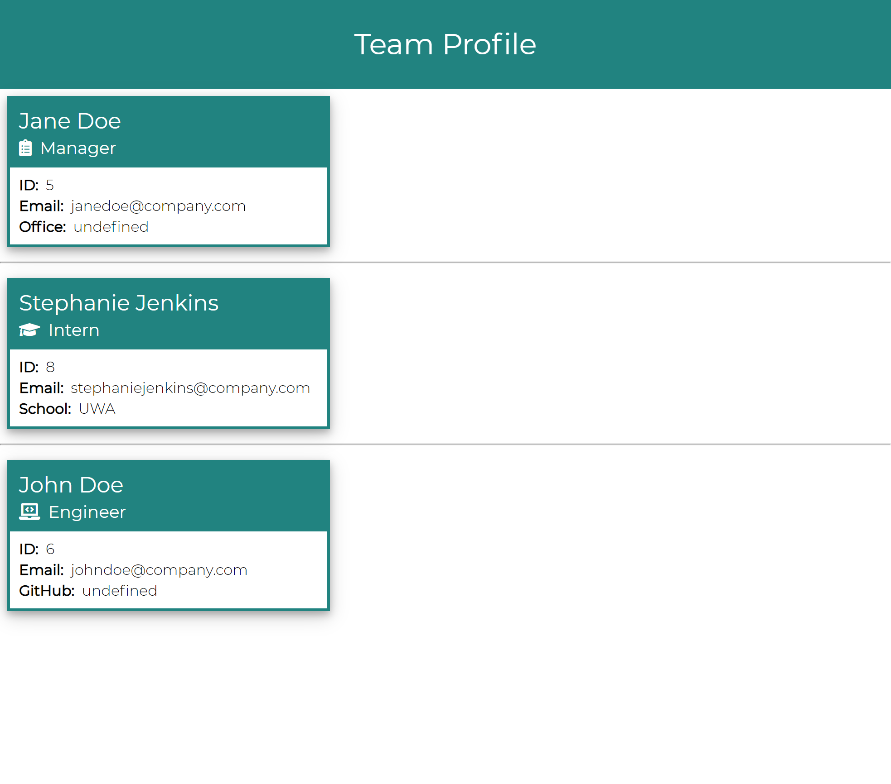

# team-profile-generator

## Description

A Node.js command-line application that takes input about members of a software engineering team, then generates an HTML webpage that displays a team report.

## Table of Contents

-   [Installation](#installation)
-   [Usage](#usage)
-   [License](#license)
-   [Credits](#credits)
-   [Contributing](#contributing)
-   [Tests](#tests)
-   [Questions](#questions)

## Installation

Run 'npm i' from the command line to install required packages.

## Usage

Run 'node index.js' to initialize and answer prompts. To view report, open file called 'index.html' (located in the 'dist' folder) in a browser.

## Contributing

To contribute to this project, please reach out to the creator via email (contact details below).

## Tests

Run 'npm run test' from the command line to run tests. 

## Questions

For any questions pertaining to this project, the developer can be reached via any of the contact methods listed below.
Please ensure that you include the name of this project ("readme-generator") in any communications.

-   [GitHub](https://github.com/stephje)
-   [Email](mailto:s.jenkins3018@gmail.com)

## Screenshot of Deployed Application

## Video Walkthrough

Click [here](https://drive.google.com/file/d/1t8DYxcrco1yHBf4_5lzm-UxT4Nh1k0MF/view) to view video walkthrough.